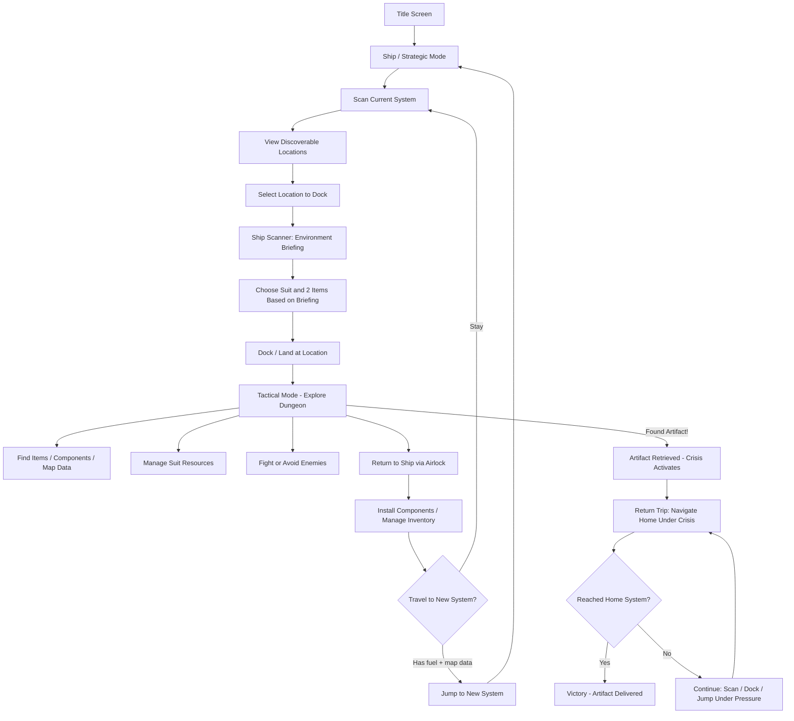

# Dreadnought Roguelike - Vertical Slice Plan

## Tech Stack

- **Python 3.11+** with **python-tcod** (rendering, FOV, pathfinding, BSP dungeon gen)
- **tcod** handles both ASCII console rendering now and tileset rendering later (built-in support for both)
- Data-driven design: items, creatures, environments, and star systems defined in JSON/YAML for easy tuning

## Project Structure

```
rougelike/
  main.py                    # Entry point
  requirements.txt           # tcod, numpy
  engine/
    game_state.py            # State machine (menu, strategic, tactical, etc.)
    input_handler.py         # Per-state input handling
    renderer.py              # Rendering abstraction layer (for ASCII->tile swap later)
    message_log.py           # Scrollable message log
  game/
    entity.py                # Entity base with component-like design
    player.py                # Player: HP, defense, status, inventory
    creature.py              # NPC/enemy: AI behaviors, stats
    ship.py                  # Ship: fuel, engine, nav range, cargo, installed components
    items.py                 # Items: weapons, tools, suit modules, ship components, map data
    suit.py                  # Suit: environment protection, resource pools (O2, heat resist, etc.)
    combat.py                # Turn-based combat resolution
    environment.py           # Environmental hazard system (per-turn resource drain)
  world/
    galaxy.py                # Galaxy as a graph of star systems with edges (travel routes)
    star_system.py           # System: star type, list of locations (derelicts, asteroids, stations)
    location.py              # Location: type, environment properties, whether scanned/visited
    dungeon_gen.py           # Procedural map gen (derelict corridors, asteroid mines, bases)
    game_map.py              # Tile grid, FOV, pathfinding for tactical mode
  ui/
    screens.py               # Title, game over, victory screens
    strategic_ui.py          # Star system view, scan results, navigation
    tactical_ui.py           # Dungeon HUD, suit resources, minimap
    menus.py                 # Inventory, loadout selection, trade
  data/
    items.json               # Item definitions (name, type, stats, rarity)
    creatures.json           # Creature definitions (name, hp, ai_type, loot)
    environments.json        # Environment types (vacuum, high_heat, low_gravity, etc.)
    galaxy.json              # Starting galaxy layout (systems, connections)
```

## Starting Conditions

The player begins each run with:

- A basic ship (low fuel capacity, basic engine, basic ship scanner)
- An EVA suit (handles vacuum ~50 turns, minimal cold resistance, no radiation protection, +0 defense)
- **No equipment** -- no weapons, no tools, no scanner, no credits
- Bare-handed melee: 1 damage, melee range only. Survivable against a single weak enemy but costly in HP.

The first star system is **fully random** (no designed tutorial). However, early systems use gentler generation parameters: fewer enemies, weaker enemies, more floor loot, fewer/milder interaction hazards.

## Core Game Loop




## Opening Game Flow

The first system is a **scavenger scramble**. With no equipment, every item found dramatically changes the player's options. The early game teaches systems through play, not tutorials.

### How Each Location Type Plays

**Derelict Spacecraft** -- *the scavenger's pick*

- Vacuum environment (EVA suit handles it, ~50 turn O2 clock)
- In early systems: small (8-12 rooms), low threat (1-2 malfunctioning bots, or empty)
- Items findable without tools: dead crew member's sidearm on the floor, wrench on a workbench, basic scanner in a supply locker
- Some items behind interactive objects (consoles, sealed crates) that may have hazards -- in early systems, hazard chance is low and severity is minor
- The suit O2 timer creates urgency: can't search every room, must triage
- **Risk/reward: moderate risk, best early loot**

**Trading Colony** -- *the safe bet*

- Breathable atmosphere (EVA suit O2 doesn't deplete, effectively unlimited time)
- Friendly NPCs, no ambient combat threat
- Traders exist but player has no credits and nothing to sell initially
- **Ways to bootstrap here:**
  - Salvage bin / junk pile near the docks: 1-2 low-quality free items (cracked scanner, bent pipe)
  - Job board: small tasks like "Clear vermin from cargo bay" -- a tiny 3-4 room side-dungeon with weak enemies, reward is credits or a basic item
  - Theft: player CAN steal from traders, but gets flagged hostile at that colony (consequences persist)
- **Risk/reward: low risk, low reward, but a safe starting path**

**Star Base** -- *the structured option*

- Can be operational (pressurized common areas, depressurized damaged sections) or abandoned
- If operational: similar to colony but military/industrial feel. Job board with slightly harder tasks, better rewards.
- If abandoned: functions like a large derelict with more rooms, more loot, but also more threats
- **Risk/reward: variable depending on operational state**

**Asteroid Field** -- *the trap (until you have tools)*

- Vacuum environment, possibly low gravity
- Mineral seams exist but require a mining laser to extract
- May have an abandoned mining outpost or scattered surface debris to scavenge
- Without mining laser, limited to outpost scavenging (if outpost exists)
- If no outpost, mostly a dead end -- but teaches the player that tools gate certain content
- **Risk/reward: potentially wasted trip early on, high value with proper tools**

### The Bootstrapping Loop

The first few excursions follow a natural progression:

1. **First dock** (no items): player explores cautiously, avoids or barely survives enemies, grabs floor loot. Returns with 1-3 basic items.
2. **Second dock** (1-2 items): player can now fight OR scan, but not both. Makes a meaningful loadout choice. Can push deeper, find better items.
3. **Third dock onward**: player has real options -- different loadouts for different situations. The 2-item limit remains a constraint throughout the entire game.

### Jobs and Tasks

Colonies and operational bases offer **job boards** -- small directed tasks that reward credits or items.

- Jobs create mini-dungeons or objectives within the location (clear a room, retrieve an item, deliver a message)
- Early jobs are simple and low-danger (pest control, basic retrieval)
- Later systems offer harder jobs with better rewards (clear pirate nest, salvage from irradiated section)
- Jobs are the primary way to earn credits for trading
- A location's job board refreshes if the player leaves and returns later

### Theft

Players can attempt to steal from traders or loot friendly locations.

- Stealing is a deliberate action with a chance of detection based on a simple stealth roll
- If caught: flagged hostile at that location. NPCs attack, trader access revoked.
- Consequence persists for the run -- a "desperate measures" option, not a free loot strategy
- Some players will use this as a high-risk shortcut; that's a valid playstyle

## Difficulty Scaling

Generation parameters scale based on how many systems deep the player has traveled:

**Early Systems (1-2 jumps)**

- Floor loot: common (items lying around in accessible rooms)
- Interaction hazards: occasional, mild severity
- Enemy count: 1-3 per location, weak types (vermin, broken bots)
- Environment: single mild hazard per location
- Scanner importance: nice to have

**Mid Systems (3-5 jumps)**

- Floor loot: rare
- Interaction hazards: frequent, moderate severity
- Enemy count: 4-8 per location, moderate types (pirates, security drones)
- Environment: multiple overlapping hazards
- Scanner importance: very useful

**Late Systems (6+ jumps)**

- Floor loot: almost none (most items behind hazardous interactions)
- Interaction hazards: on most interactable objects, severe
- Enemy count: 8-15 per location, strong types (military bots, alien predators)
- Environment: harsh, stacking hazards (vacuum + radiation + extreme cold)
- Scanner importance: essential for survival

## Key Design Decisions

### Rendering Abstraction (ASCII now, tiles later)

- All rendering goes through a `Renderer` class that maps game entities to visual representations via a lookup table
- Entities store a `glyph` (character + foreground/background color) used for ASCII mode
- Later, swap the lookup to reference a tileset atlas -- tcod natively supports this via `tcod.tileset`

### State Machine

- `GameState` enum: `TITLE`, `STRATEGIC`, `LOADOUT`, `TACTICAL`, `INVENTORY`, `GAME_OVER`
- Each state has its own `on_enter()`, `handle_input()`, `update()`, `render()` methods
- Transitions carry context (e.g., STRATEGIC -> LOADOUT carries the selected location's environment data)

### Strategic Mode

- The galaxy is a weighted graph: nodes are star systems, edges have distance (fuel cost)
- Each system has a star type and 2-5 locations (procedurally generated or from data)
- Ship stats determine: max jump distance (engine), fuel capacity, cargo space, scan quality
- UI is a simple list/map of the current system's locations + known connected systems
- **Two levels of scanning:**
  - **System scan** (from strategic view): reveals the list of locations in the current system (type + rough description). Available any time in a system.
  - **Location scan / environment briefing** (when selecting a location to dock): the ship's scanner analyzes the specific location and reports environmental hazards, severity, and threat level. Quality of intel depends on the ship's scanner component. This briefing is shown *before* the loadout screen so the player can make informed suit/gear choices.

### Tactical Mode

- Dungeon generated per-location type:
  - **Derelict ship**: narrow corridors, rooms, airlocks, wrecked sections
  - **Asteroid mine**: open caverns connected by tunnels
  - **Station/colony**: grid-like rooms, wider corridors, shops
- Turn-based: player acts, then all creatures act
- FOV using tcod's FOV algorithms
- Environmental hazards tick each turn (e.g., -1 O2 per turn in vacuum, -1 heat resist per turn in extreme heat)
- Suit resource bar always visible in HUD
- Exit tile (airlock/landing pad) returns player to ship

### Scan Briefing and Loadout System

When the player selects a location to dock at, the ship's scanner displays an **environment briefing** screen before the loadout screen. This is the critical information that drives gear choices.

**Scan briefing shows:**

- Location type (derelict, asteroid mine, station, etc.)
- Active environmental hazards with severity: e.g., `VACUUM`, `HIGH HEAT (severe)`, `LOW GRAVITY`, `RADIATION (moderate)`
- Threat level estimate (based on ship scanner quality): `LOW / MODERATE / HIGH / UNKNOWN`
- Recommended suit type (helpful hint, not mandatory)

**Scan quality depends on the ship's scanner component:**

- Basic scanner: shows location type and primary hazard only
- Upgraded scanner: shows all hazards with severity, threat level, and recommendations

**Loadout flow (after reviewing the briefing):**

- Player picks 1 suit from available suits on the ship
- Player picks 2 items (weapons/tools) from ship inventory
- Suits have: name, environment_resistances (dict of hazard_type -> max_turns), defense_bonus
- Example: "EVA Suit" gives 50 turns of vacuum, 10 turns of extreme cold, +1 defense
- Suit resources deplete per turn based on location environment
- When a resource hits 0, player takes damage each turn (forces retreat)
- Suits can only be changed back on the ship

### Interaction Hazards and Scanner Tool

Interactable objects (consoles, mineral seams, containers, wrecked machinery, etc.) can have **hidden hazards** attached to them. When the player interacts without scanning first (or with a low-level scanner), the hazard triggers blindly.

**How it works:**

- Each interactable object can have an optional `hazard` property: type (electric, radiation, explosive, gas, structural) + severity (minor/moderate/severe) + damage + equipment_damage flag
- The player can **use their scanner tool on an adjacent object** before interacting (costs 1 turn)
- Scanner quality determines what is revealed:
  - **No scanner**: no warning at all, hazard always triggers
  - **Basic scanner**: reveals that a hazard exists ("WARNING: hazard detected") but not the type or severity
  - **Advanced scanner**: reveals hazard type and severity ("WARNING: electrical hazard, moderate -- powered conduit")
  - **Military scanner**: reveals everything + suggests safe interaction method ("Discharge conduit first via adjacent panel")
- If the player knows the hazard type, they can make informed choices: skip it, use a tool to mitigate, or accept the risk if their suit resists that damage type

**Hazard outcomes when triggered:**

- **Electric**: HP damage, chance to damage a carried item (reduce durability or destroy)
- **Radiation**: HP damage over several turns (lingers), suit radiation pool drains faster
- **Explosive**: HP damage in a radius, may destroy walls/objects nearby, alerts enemies
- **Gas**: creates a cloud of tiles that drains suit atmosphere resource for several turns
- **Structural**: collapse blocks a path, potential HP damage, may trap player

**Suit interaction:** suits with resistance to the hazard type reduce or negate the damage (e.g., a hazard suit absorbs the first radiation hit, an EVA suit's insulation reduces electric damage)

**Equipment damage:** some hazards can damage carried items. Items have a simple `durability` value; when it hits 0, the item is destroyed. Repair kits restore durability. This makes repair kits and scanner tools both valuable loadout picks alongside weapons.

**Design intent:** the scanner tool competes for one of the player's 2 item slots. Bringing a scanner means more information and safer interactions, but one less weapon/tool. This is a deliberate risk/reward tradeoff. Upgrading to a better scanner lets you get more intel without sacrificing combat readiness (since a better scanner reveals more per use, making each scan turn more valuable).

### Item System

- Items have: name, type (weapon/tool/suit/ship_component/map_data/consumable), stats, weight, durability
- **Weapons**: damage, range (melee=1, ranged=4+), ammo (optional), durability
- **Tools**: mining laser (breaks special walls, mines resources), scanner (scan objects for hazards, reveals map), repair kit (restores item durability or suit resource)
- **Ship components**: engine upgrade, fuel tank, nav computer, scanner array
- **Map data**: unlocks connections to new star systems
- **Consumables**: med-kit (heal), O2 canister (restore suit O2)

### Combat

- Bare-handed: 1 damage, melee range only. Available from the start, always a last resort.
- With weapon: `damage = weapon.power - defender.defense`, minimum 1 damage per hit
- Ranged weapons use line-of-sight (tcod's bresenham), may require ammo
- Melee weapons: higher damage than fists, no ammo, risk of taking damage in return
- Enemies have basic AI: wander, chase on sight, flee at low HP
- Player can choose to flee (disengage and move away; enemies may pursue)

### The Vertical Slice Scope (What Gets Built)

**World:**

- 3 star systems (procedurally generated, connected as a graph)
- 2-4 locations per system drawn from: derelict, asteroid, colony, starbase
- Difficulty scales by system depth (early=gentle, late=harsh)

**Player:**

- Starts with nothing but EVA suit. Bare-handed combat (1 dmg).
- HP, defense, status effects
- 2-item loadout chosen before each dock

**Suits (2 types):**

- EVA Suit: vacuum 50 turns, cold 10 turns, +0 defense
- Hazard Suit: radiation 40 turns, heat 30 turns, +1 defense, no vacuum protection

**Weapons (4):**

- Bent Pipe (melee, 2 dmg, common junk found early)
- Stun Baton (melee, 3 dmg, chance to stun)
- Low-power Blaster (ranged, 3 dmg, 20 ammo)
- Shotgun (ranged, 5 dmg, 3 range, 10 ammo)

**Tools (3 tiers + utility):**

- Basic Scanner, Advanced Scanner, Military Scanner (scan objects, scaling detail)
- Mining Laser (breaks mineable walls, mines resources, doubles as weak ranged weapon)
- Repair Kit (consumable, restores item durability or suit resource)

**Enemies (4 types):**

- Vermin/space rats (1 HP, 1 dmg -- early system filler)
- Malfunctioning bot (3 HP, 2 dmg -- derelicts)
- Pirate (5 HP, 3 dmg, may drop items -- colonies/bases)
- Security drone (4 HP, 3 dmg ranged -- starbases)

**Friendly NPCs:**

- Trader (buy/sell at colonies and operational bases)
- Job board (tasks that reward credits or items)

**Ship upgrades:**

- Engine upgrade (increases jump range)
- Fuel tank (increases fuel capacity)
- Nav computer (reveals more connected systems on the galaxy map)
- Scanner array (improves pre-dock briefing quality)

**Interaction hazards (5 types):**

- Electric, radiation, explosive, gas, structural

**The Dreadnought and Endgame Artifacts:**

The Dreadnought is found in the deepest system. Inside is a special high-difficulty dungeon. At its core, the player finds one of 5 randomly selected artifacts. Each artifact must be brought back to the player's home (starting) system to win.

Each artifact has:

- A **positive outcome** (narrative payoff on successful return)
- A **return crisis** (unique mechanic that makes the journey home dangerous in a distinct way)

The 5 artifacts:

- **The Navarch's Codex** -- complete star charts of the old empire. *Return crisis: broadcasts your position. Hostile scavengers/pirates appear at every system on the return. More combat encounters at each stop.*
- **The Helix Engine** -- the Dreadnought's lost drive core. *Return crisis: unstable. Grants unlimited jump range but each jump triggers a random "fold event" (ship damage, displacement to unknown system, hostile anomaly).*
- **The Exodus Signal** -- a broadcast cipher that decodes a hidden transmission. *Return crisis: activation pulse alerted every faction. Systems have escalated hostility. Previously friendly locations may now be contested.*
- **The Lethe Core** -- a bioengineered seed of the old empire's network. *Return crisis: alive and parasitic. Drains ship power, 50% more fuel per jump. Forces extra stops to scavenge fuel from dangerous locations.*
- **The Warden's Seal** -- containment seal for something the old empire captured. *Return crisis: integrity meter counting down. Taking damage or triggering hazards accelerates decay. Must reach home before it hits zero or special bad ending.*

**Win condition:** return the artifact to the home system. **Loss conditions:** death (any time), or seal breach (Warden's Seal only).

## Concrete Implementation Details

### Window and Display

- Window: 80 columns x 50 rows (classic roguelike dimensions)
- tcod console rendering using `tcod.context` and `tcod.console`
- Font: tcod's built-in CP437 tileset (ASCII-compatible, supports box-drawing characters)
- Later can swap to a custom `.png` tileset via `tcod.tileset.load_tilesheet()` without changing game code

### Screen Layout (Tactical Mode)

```
+------------------------------------------------------+------------+
|                                                      | HP: 10/10  |
|                                                      | DEF: 0     |
|                    MAP VIEWPORT                      |            |
|                    (60 x 40)                         | SUIT:      |
|                                                      | O2: 48/50  |
|                                                      | RAD: --    |
|                                                      |            |
|                                                      | ITEMS:     |
|                                                      | 1) Blaster |
|                                                      | 2) Scanner |
+------------------------------------------------------+------------+
| Message log (80 x 8, scrollable)                                  |
|                                                                   |
+-------------------------------------------------------------------+
```

- Map viewport: 60 x 40 tiles, camera follows player
- Stats panel: 20 x 42 right side (HP, defense, suit resources, loadout)
- Message log: 80 x 8 bottom (scrollable with PgUp/PgDn)

### Key Bindings

- **Movement**: arrow keys (4-dir) and numpad (8-dir), also vi keys (hjklyubn)
- **Wait**: `.` or numpad 5
- **Interact**: `e` (use adjacent interactable object)
- **Scan**: `s` (use scanner tool on adjacent object, if scanner equipped)
- **Inventory**: `i`
- **Pickup**: `g` or `,`
- **Drop**: `d`
- **Look**: `l` (enter cursor mode, describe tile under cursor)
- **Fire/Zap**: `f` (ranged attack, if ranged weapon equipped)
- **Use item**: `u` (use consumable from inventory)
- **Escape**: `Esc` (back out of menus, or open pause menu from gameplay)

### Player Starting Stats

- HP: 10 (max 10)
- Defense: 0 (modified by suit)
- Bare-handed damage: 1
- Credits: 0
- Movement speed: 1 tile per turn

### Death and Permadeath

- When HP reaches 0, the player dies. Game over screen with run summary (systems visited, items found, enemies defeated).
- **Permadeath**: no saving mid-run. Each death is a fresh start. This is a roguelike.
- Optional stretch goal: unlock persistent meta-progression (e.g., start with a slightly better ship after N runs). Not in the vertical slice.

### tcod Architecture Pattern

We follow a simplified version of the tcod tutorial pattern (rogueliketutorials.com) with these adaptations:

- **Actions**: input is translated into `Action` objects (`MovementAction`, `InteractAction`, `ScanAction`, etc.) which are executed by the engine
- **Engine**: owns the game state, processes actions, manages turn order
- **State handlers**: each game state (`TacticalState`, `StrategicState`, `InventoryState`, etc.) implements `on_render(console)` and `ev_keydown(event) -> Action | None`
- **Entity-component style**: entities have optional component dicts (e.g., `fighter`, `ai`, `inventory`, `item`) rather than deep class hierarchies. This keeps things flexible.
- **Game map**: wraps a numpy array of tile structs. Uses `tcod.map.compute_fov()` for visibility. Tiles are numpy structured arrays with dtype for walkable, transparent, light/dark glyphs.

## Implementation Phases

Phases are ordered to produce something playable as early as possible, then layer systems on. Each phase has numbered sub-steps that can be implemented and tested independently.

### Phase 1: Foundation

**1.1 Project scaffolding**

- Create directory structure as specified in Project Structure section
- `requirements.txt` with `tcod` and `numpy`
- Empty `__init__.py` files in each package
- `main.py` that imports and runs the engine

**1.2 Window and rendering**

- Initialize tcod context: 80x50 console, CP437 tileset
- Create a root `tcod.console.Console`
- Render loop: clear console, draw, present
- Graceful shutdown on window close

**1.3 State machine**

- Base `State` class with `on_enter()`, `on_exit()`, `ev_keydown(event)`, `on_render(console)` methods
- `Engine` class that holds the current state and delegates input/render to it
- State transitions via `engine.push_state()` / `engine.pop_state()` / `engine.switch_state()`
- States: `TitleState` (placeholder), `TacticalState` (placeholder), `GameOverState` (placeholder)

**1.4 Title screen**

- Render "DREADNOUGHT" in large ASCII art (or styled text) centered on screen
- "Press any key to begin" prompt
- On keypress: transition to `TacticalState` (initially jumps straight to dungeon for testing; later will go to Strategic)

**1.5 Message log**

- `MessageLog` class: stores list of `(text, color)` tuples
- `add_message(text, color)` method
- `render(console, x, y, width, height)` draws recent messages, supports scrolling
- Accessible globally (passed into states or held by engine)

**Checkpoint**: window opens, title screen shows, press key to enter a blank tactical screen, message log renders at bottom.

### Phase 2: Tactical Core

**2.1 Tile types and game map**

- Define tile dtype as numpy structured array: `walkable: bool`, `transparent: bool`, `dark: (ch, fg, bg)`, `light: (ch, fg, bg)`
- Tile type factories: `floor()`, `wall()`, `door_closed()`, `door_open()`
- `GameMap` class: holds numpy tile array, `visible` and `explored` boolean arrays
- `in_bounds(x, y)`, `is_walkable(x, y)` methods
- Render method: draws tiles based on visible/explored state (visible=light colors, explored-but-not-visible=dark/dim colors, unexplored=black)

**2.2 Dungeon generation**

- Simple room-and-corridor algorithm (not BSP yet, simpler to debug):
  - Place N rectangular rooms (random size 4-10 x 4-8) without overlap
  - Connect each room to the next with L-shaped corridors
  - Place a closed door at each corridor-to-room junction (chance-based)
- Returns a `GameMap` + list of room centers (for placing entities later)
- Designate first room center as player spawn, last room center as exit tile

**2.3 Player entity and movement**

- `Entity` base class: `x`, `y`, `char`, `color`, `name`, `blocks_movement`
- `Player` extends or composes: `hp`, `max_hp`, `defense`, `power` (starts at 1 for bare-handed)
- Player rendered as `@` white-on-black
- Input handler for tactical mode: arrow/numpad/vi keys -> `MovementAction(dx, dy)` or `WaitAction`
- `MovementAction.perform()`: check target tile walkable + not blocked by entity, move player
- Bump into wall = no move, bump into door = open it, bump into enemy = attack (added in 2.5)

**2.4 FOV**

- Call `tcod.map.compute_fov(transparency_array, player.x, player.y, radius=8, algorithm=tcod.FOV_SYMMETRIC_SHADOWCAST)`
- Update `game_map.visible` each turn
- Merge visible into `game_map.explored` (once seen, stays explored)
- Entities only render if on a visible tile (enemies hidden in fog)

**2.5 Enemies and turn system**

- Enemy entities: `char`, `color`, `hp`, `defense`, `power`, `ai` component
- Place 1-3 enemies in random rooms during dungeon gen
- Turn system (simple): player acts first (blocks until input), then each enemy acts in order
- Enemy AI (`HostileAI`):
  - If player visible (within FOV): move toward player (use `tcod.path.AStar` or simple chase)
  - If adjacent to player: `MeleeAction` instead of move
  - If player not visible: wander randomly (move to random adjacent walkable tile, or wait)
- Enemies block movement (can't walk through them)

**2.6 Combat and death**

- `MeleeAction.perform()`: `damage = attacker.power - defender.defense`, min 1
- Apply damage to defender HP
- If defender HP <= 0: remove from map (if enemy), or trigger game over (if player)
- Message log: "You hit the Rat for 1 damage." / "The Bot hits you for 2 damage."
- `GameOverState`: render "YOU DIED" + run summary, press key to return to title
- Render HP in stats panel: `HP: 8/10` with color (green > yellow > red)

**2.7 Items on the ground**

- `Item` entity: `char`, `color`, `name`, `item_component` (type-specific data)
- Items don't block movement; multiple items can share a tile
- `GameMap` stores items in a separate list (not in the tile array)
- Place 2-4 items in random rooms during dungeon gen (weapons for now: Bent Pipe, Low-power Blaster)
- Render items on visible tiles (below entities)
- `PickupAction`: if items on player's tile, pick up first item, add to player inventory, remove from map
- Message log: "You pick up a Bent Pipe."

**2.8 Inventory screen**

- `InventoryState`: overlay that lists player's carried items
- Press `i` to open, `Esc` to close
- Items listed with letter keys (a, b, c...)
- Select an item to see description (name, stats)
- `DropAction`: drop selected item onto current tile
- For now: selecting a weapon equips it (sets player.power = weapon.power, player.range = weapon.range)
- Equipping a weapon replaces the previous one (previous goes back to inventory)

**2.9 Exit tile and session end**

- Exit tile rendered as `>` (bright green or cyan) placed in the last room
- Stepping on it shows a message: "You return to your ship." and transitions to `GameOverState` (temporary; later transitions to strategic mode)
- This completes the tactical session loop

**Checkpoint**: fully playable roguelike dungeon. Generate dungeon, explore with FOV, fight enemies with bare hands or found weapons, pick up items, manage inventory, escape via exit or die trying.

### Phase 3: Suit, Environment, and Interaction Hazards

**3.1 Environment and suit resource system**

- `Environment` data class: dict of `{hazard_type: severity}` (e.g., `{"vacuum": 1, "cold": 0.5}`)
- Each dungeon has an assigned `Environment` (hardcoded for now; later comes from location data)
- `Suit` data class: `name`, `resistances: {hazard_type: max_turns}`, `defense_bonus`, `current_pools: {hazard_type: remaining_turns}`
- Each turn in tactical mode: for each active hazard in the environment, if suit has resistance -> decrement that pool; if pool at 0 or no resistance -> deal 1 HP damage per turn
- Player starts each session with suit pools at max

**3.2 Suit resource HUD**

- Stats panel shows active suit resources as bars: `O2: ████░░ 34/50`
- Color coding: green (>50%), yellow (25-50%), red (<25%)
- When a resource hits 0: flash the bar, message "WARNING: O2 depleted! Taking damage!"
- For testing: hardcode dungeon environment to vacuum, give player EVA suit with 50 O2

**3.3 Interactable objects**

- New entity type: `Interactable` -- console, crate, mineral seam, locker, etc.
- Rendered as distinct characters: `&` (console), `=` (crate), `%` (mineral seam)
- Placed during dungeon gen (1-3 per dungeon)
- Player presses `e` when adjacent to interact
- Interaction yields: an item (added to player inventory or dropped on floor if hands full), credits, or nothing
- Message log: "You search the supply locker... Found a Basic Scanner!"

**3.4 Hidden hazards on interactable objects**

- Interactable objects have optional `hazard` property: `{type, severity, damage, equipment_damage}`
- When player interacts without scanning: hazard triggers automatically
- Hazard effects:
  - `electric`: immediate HP damage, chance (50%) to reduce durability of a random carried item by 1
  - `radiation`: 1 HP damage per turn for 3 turns (status effect on player)
  - `explosive`: 3 HP damage, alert enemies in radius (set them to chase)
  - `gas`: spawn gas cloud tiles (3x3) that drain suit atmosphere for 5 turns
  - `structural`: 2 HP damage, wall tiles placed to block path (collapse)
- Dungeon gen assigns hazards based on difficulty parameters (early: 20% chance, mild; late: 70% chance, severe)

**3.5 Scanner tool and scanning action**

- Scanner is an item type with a `scanner_tier` property (basic=1, advanced=2, military=3)
- `ScanAction`: press `s` while adjacent to an interactable, costs 1 turn
- Result depends on tier vs hazard:
  - Tier 1: "WARNING: Hazard detected." (knows it exists, nothing more)
  - Tier 2: "WARNING: Electrical hazard (moderate). Powered conduit." (type + severity)
  - Tier 3: "Electrical hazard (moderate). Discharge via adjacent panel to neutralize." (full detail)
- If no hazard: "Scan clear. Safe to interact."
- Player can then choose to interact or skip

**3.6 Item durability and consumables**

- All items (weapons, tools) gain a `durability` stat (e.g., Bent Pipe: 5, Blaster: 15)
- Hazards that cause equipment damage reduce durability of a random carried item
- Durability at 0: item destroyed, removed from inventory. Message: "Your Bent Pipe breaks!"
- `Repair Kit` (consumable): use from inventory to restore 5 durability to a chosen item
- `Med-kit` (consumable): use to restore 5 HP
- `O2 Canister` (consumable): use to restore 20 O2 to suit
- Consumables are removed after use

**Checkpoint**: dungeon with an O2 timer ticking down, interactable objects that might shock/irradiate you, scanner tool that reveals hazards before you touch things, items that can break. Real tension and decision-making.

### Phase 4: Strategic Mode

**4.1 Galaxy and star system generation**

- `Galaxy` class: a graph (dict of `system_id -> StarSystem`, dict of `system_id -> [(neighbor_id, fuel_cost)]`)
- Generate 3 systems: assign random names (from a name list), star types, connect as a simple chain (system 1 <-> 2 <-> 3)
- `StarSystem` class: `name`, `star_type`, `locations: list[Location]`, `depth` (distance from start, for scaling)
- `Location` class: `type` (derelict/asteroid/colony/starbase), `environment`, `threat_level`, `scanned`, `visited`
- Each system generates 2-4 locations with types weighted by system depth

**4.2 Ship entity**

- `Ship` class: `fuel` (current/max), `engine_range`, `cargo: list[Item]`, `installed_components: dict`, `scanner_quality`
- Starting ship: fuel 100/100, engine_range 1 (can reach adjacent systems), basic scanner
- `install_component(item)`: upgrades ship stats based on component type
- `consume_fuel(amount)`: deduct fuel, prevent travel if insufficient
- Ship cargo serves as the persistent inventory between tactical sessions

**4.3 Star system map UI**

- `StrategicState`: renders the current system
- Display: star name and type at top, list of locations below with icons and status
- Location display: `[D] Abandoned Relay Station - UNSCANNED` or `[C] Haven's Rest - Breathable, Threat: LOW`
- Connected systems shown at bottom: `Jump to: Vega-9 (fuel: 30) | Tau Ceti (fuel: 45, OUT OF RANGE)`
- Navigation: up/down to select location or system, `Enter` to dock or jump
- `[S]` key to scan selected location (reveals environment/threat)

**4.4 Environment briefing screen**

- When player selects a location to dock: transition to `BriefingState`
- Displays: location type, environment hazards (filtered by ship scanner quality), threat level
- Basic ship scanner: shows type + primary hazard + "THREAT: UNKNOWN"
- Upgraded ship scanner: shows all hazards with severity + accurate threat level
- `[C]ontinue to loadout` or `[B]ack` to system map

**4.5 Loadout selection screen**

- `LoadoutState`: pick suit and 2 items from ship cargo
- Left column: available suits (highlight selected)
- Right column: available items (select up to 2, highlight selected)
- Selected items shown at bottom: `LOADOUT: EVA Suit | Low-power Blaster | Basic Scanner`
- `[Enter]` to confirm and begin tactical session
- Items move from ship cargo to player for the session; on return, items move back + any new finds

**4.6 Mode transitions (full loop)**

- Title -> Strategic (generate galaxy, place player in system 1)
- Strategic -> Briefing (select location) -> Loadout (pick gear) -> Tactical (generate dungeon, begin session)
- Tactical exit tile -> Strategic (return items to ship cargo, add new finds)
- Tactical death -> Game Over -> Title
- Strategic jump -> Strategic (new system, deduct fuel)
- Wire up all transitions with proper context passing

**Checkpoint**: the complete game loop works end-to-end. Fly to system, scan locations, read briefing, pick gear, explore dungeon, return, fly to next system.

### Phase 5: NPCs, Trade, Jobs, and Ship Upgrades

**5.1 Friendly NPCs and trading**

- `FriendlyAI` component: NPC does not attack, has dialogue on bump
- Trader NPC: placed in colony/starbase tactical maps. Bump to open trade screen.
- `TradeState`: two-column UI. Left: trader inventory (item + price). Right: player inventory (item + sell value).
- Buy: deduct credits, add item to player inventory. Sell: add credits, remove item.
- Trader inventories generated per-location with items appropriate to system depth

**5.2 Job board**

- Job board is an interactable object placed in colonies/operational bases
- Interact to open `JobBoardState`: list of 1-3 available jobs
- Job: `{description, objective_type, reward_credits, reward_item, difficulty}`
- Objective types: "clear" (kill all enemies in a sub-area), "retrieve" (find and return an item), "deliver" (bring an item to an NPC)
- Accepting a job opens a small sub-dungeon (3-5 rooms) or marks an objective in the current map
- Completing the objective: reward deposited. Message: "Job complete! +50 credits."

**5.3 Theft mechanic**

- When near trader or item display, `steal` action available (press `t`)
- Detection chance: 60% base (reduced by future stealth upgrades)
- Success: item acquired silently
- Failure: location flagged hostile. All NPCs at this location turn hostile. Trader access permanently revoked here.
- Hostile flag stored on the `Location` object, persists for the run

**5.4 Salvage bins**

- Interactable object at colonies/bases containing 1-2 free low-quality items
- No hazards on salvage bins (safe to interact)
- Items are generated from a "junk" loot table (bent pipe, cracked scanner, empty O2 canister with 5 charges)

**5.5 Ship component installation**

- From strategic mode: `[U]pgrade ship` option opens component install screen
- Lists components in cargo that can be installed
- Install: removes item from cargo, applies stat change to ship
- Engine upgrade: +1 engine_range. Fuel tank: +50 max fuel. Nav computer: reveals 1 additional connected system. Scanner array: ship scanner quality +1.

**5.6 Map data and galaxy expansion**

- Map data items: found as loot in derelicts/asteroids
- Using map data from ship cargo: reveals a new edge in the galaxy graph (connection to a new system)
- New systems are generated on-demand when revealed (type, locations, connections to further systems)
- This means the galaxy grows as the player explores -- only 3 systems exist initially, but map data can reveal more

**5.7 Mining mechanic**

- Asteroid locations have `mineral_seam` interactable objects (glyph: `%`)
- Without mining laser: "You need a mining laser to extract resources."
- With mining laser equipped: interact to mine. Yields ore/components (random from mining loot table).
- Mining laser durability decreases per use
- Mineral seams have hazard chance like other interactables (radiation leaks, gas pockets)

**Checkpoint**: full economy loop. Earn credits via jobs, buy/sell at traders, upgrade ship, use map data to find new systems, mine resources. Multiple paths to progression.

### Phase 6: Polish and Win Condition

**6.1 Dungeon layout variety**

- Derelict: narrow corridors (width 1-2), small rooms, airlock doors, some rooms open to vacuum (wall breach tiles)
- Asteroid mine: large irregular caverns (use cellular automata), narrow connecting tunnels, mineral seams on walls
- Colony: grid-like layout, wider corridors (width 2-3), shop rooms with traders, job board near entrance
- Starbase: mix of pressurized and depressurized sections, military-style rooms, security drone spawns

**6.2 Enemy variety and AI**

- Vermin (1 HP, 1 dmg): wander, flee from player if adjacent
- Malfunctioning bot (3 HP, 2 dmg): patrol a room, chase when player enters
- Pirate (5 HP, 3 dmg): chase aggressively, may drop items on death
- Security drone (4 HP, 3 dmg ranged): stationary until alerted, ranged attack, does not chase far
- Each enemy type has a loot table (e.g., pirate: 30% chance to drop a weapon or credits)

**6.3 Loot tables and difficulty scaling**

- Define loot tables per location type and system depth in data files
- Early: common floor items, junk-tier weapons/tools, few hazards
- Mid: fewer floor items, better items behind hazardous objects, moderate enemies
- Late: almost no floor items, best items behind severe hazards, tough enemies, harsh environments
- Scaling controlled by a single `difficulty` parameter derived from system depth

**6.4 The Dreadnought dungeon**

- The deepest system contains a special location: "The Dreadnought" (always present, cannot be missed)
- Larger dungeon than normal (15-20 rooms), multiple enemy types, harsh environment (vacuum + radiation)
- Final room contains one of 5 randomly selected artifacts (chosen at world gen time)
- Picking up the artifact: message describes what it is, what it does, and warns of the return crisis
- Game state flag: `artifact_retrieved = True`, `artifact_type = <type>`

**6.5 Return trip crisis mechanics**

Each artifact activates a modifier on the strategic layer for the return journey:

- **Navarch's Codex**: `hostile_encounter_modifier = +3 enemies per location` at every system on the return path. New enemy spawns at previously cleared locations.
- **Helix Engine**: `fold_event_chance = 40% per jump`. Fold events: 30% ship hull damage (lose 10% fuel capacity), 30% displacement (random system), 20% hostile anomaly (immediate tactical encounter), 20% nothing (lucky fold).
- **Exodus Signal**: `hostility_escalation = True`. Friendly locations have 50% chance to be contested (hostile NPCs mixed in). Traders may refuse service. Job boards disabled.
- **Lethe Core**: `fuel_drain_modifier = 1.5x`. Fuel cost per jump multiplied by 1.5. Ship fuel also drains 1/turn while docked (encourages quick excursions).
- **Warden's Seal**: `seal_integrity = 100`. Decreases by 1 per system jump, 2 per point of ship damage taken, 5 if a hazard triggers while docked. At 0: special game-over ("The seal fractured. Something stirs in the void...").

The player's home system is marked on the galaxy map. The return route may or may not be the same as the outward route -- the player chooses based on fuel, known systems, and which crisis they're dealing with.

**6.6 Victory and game over**

- **Victory**: arrive at home system with artifact. `VictoryState` displays artifact-specific ending text + run summary (systems visited, locations explored, enemies defeated, items found, turns taken, artifact name).
- **Death**: `GameOverState` with run summary + "You perished in the void." Press Enter -> Title.
- **Seal breach** (Warden's Seal only): special `GameOverState` variant with unique text. Still shows run summary.
- No save/load in vertical slice (stretch goal)

**6.7 Balance pass**

- Tune all numbers in data files: HP, damage, suit durations, fuel costs, item prices, hazard chances, return crisis severity
- Playtest the full loop: can a player bootstrap from nothing, reach the Dreadnought, retrieve an artifact, and survive the return?
- Each artifact's return crisis should feel threatening but beatable with good play
- Target: a successful run should take 30-60 minutes
- The Dreadnought dungeon should feel like a significant challenge (hardest location in the game)

**Checkpoint**: complete, polished vertical slice. Multiple dungeon styles, enemy variety, loot progression, 5 randomized endgame artifacts with distinct return-trip crises, victory/defeat screens, and a balanced 30-60 minute run.